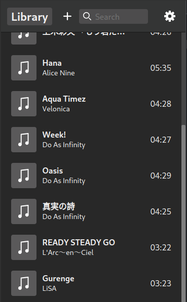
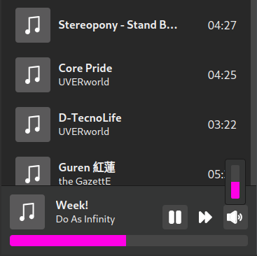
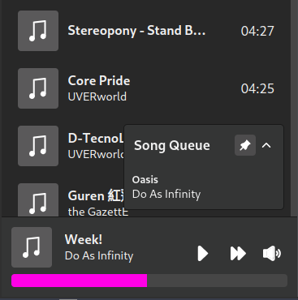
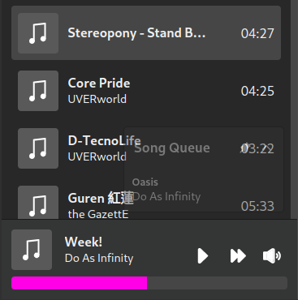

# play-music

A desktop music player made with Electron, React, and TypeScript.

## Table of Contents
1. [Goals](#goals)
2. [Technologies Used](#technologies-used)
3. [Design](#design)
4. [Project Setup](#project-setup)

## Goals
This project was made to satisfy my needs for a music player on Linux.  I wasn't happy with the options I had, so I decided to make my own application.

This is also my second large scale application which I will showcase on my portfolio.

## Technologies Used
* Electron - Chosen as the desktop application framework based on my experience with web technologies.

* React - This is my favorite JavaScript framework, it's the first I learned and I have the most experience with it.

* TypeScript

* RecoilJS - For non-local state shared across the application.

* SCSS - My CSS preprocessor of choice.

## Design
#### I designed and built this app from scratch.  No UI libraries were used.

### Mobile


### Media Player


### Song Queue


### Unpinned and unfocused


### Screenshots at larger sizes TBA

## Project Setup

### Clone

```bash
$ git clone https://github.com/Android789515/play-music.git
```

### Install

```bash
$ npm install
```

### Development

```bash
$ npm run dev
```

### Build

```bash
# For windows
$ npm run build:win

# For macOS
$ npm run build:mac

# For Linux
$ npm run build:linux
```
